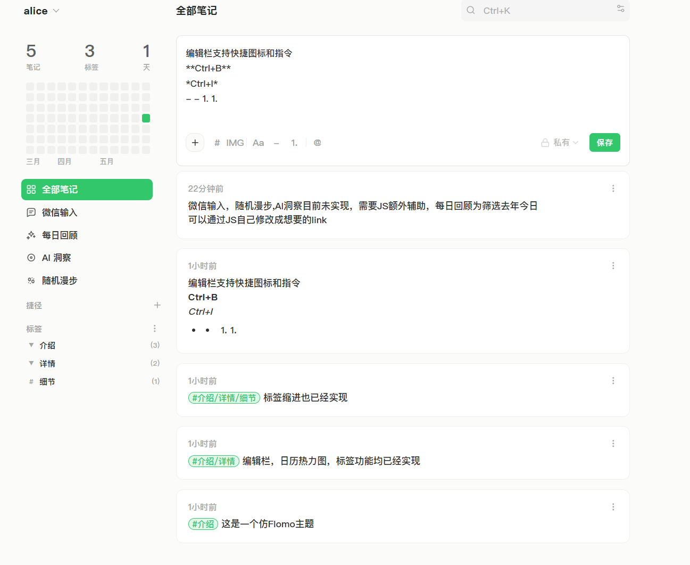

# memos-flomo-theme

A lightweight flomo-inspired theme for [Memos](https://github.com/usememos/memos), designed to work through Memos' built-in **Additional style** and **Additional script** settings for easy compatibility with official Docker updates.

Driven by GPT5.5, Deepseek V4, and some manual verification tweaks.

[Chinese README](./README.zh-CN.md)

## Preview

## What This Theme Changes

- Applies a restrained flomo-like green palette with lighter surfaces, softer borders, and calmer hover states.
- Uses a Chinese-friendly sans-serif stack: `BarlowF, "PingFang SC", "Microsoft YaHei", Helvetica, Arial, sans-serif`.
- Makes the desktop layout more compact, with the sidebar and content area visually closer together.
- Uses a wider flomo-like sidebar and a constrained content column to keep editor and memo cards from feeling oversized.
- Hides the desktop left navigation rail and moves its main entries into a username hover menu.
- Moves search to the upper-right content header, aligned with the current view title.
- Shows the current username at the top of the sidebar.
- Replaces the original month calendar with a 12-week, Monday-first, 84-cell recent activity heatmap.
- Adds a flomo-style quick navigation area for All Notes, Inbox, Daily Review, AI Insight, and Random Walk (custom link, functionality not implemented).
- Uses consistent icon slots for sidebar quick links.
- Converts tag display into a vertical list with expand/collapse for nested tags like `life/books`.
- Expands the editor when focused, then shrinks it back when focus leaves.
- Adds optional editor helper buttons for tags, media upload, bold, bullet lists, ordered lists, and mentions.
- Normalizes editor helper button sizing.
- Adds Markdown keyboard shortcuts such as `Ctrl/Cmd+B` for bold and list shortcuts.
- Adds global shortcuts: `Ctrl/Cmd+K` focuses memo search, and `Ctrl/Cmd+N` focuses the new memo editor.

## Files

- `flomo-additional-style.css`: paste into Memos **Settings -> System -> Additional style**.
- `flomo-additional-script.js`: paste into Memos **Settings -> System -> Additional script**.

## Install

1. Open Memos as an admin.
2. Go to **Settings -> System**.
3. Paste `flomo-additional-style.css` into **Additional style**.
4. Paste `flomo-additional-script.js` into **Additional script**.
5. Save and refresh the page.

## Notes

This theme intentionally avoids patching Memos source code, so it should keep working with official Docker updates more easily. Some selectors may still need small adjustments when upstream Memos changes its DOM structure.
